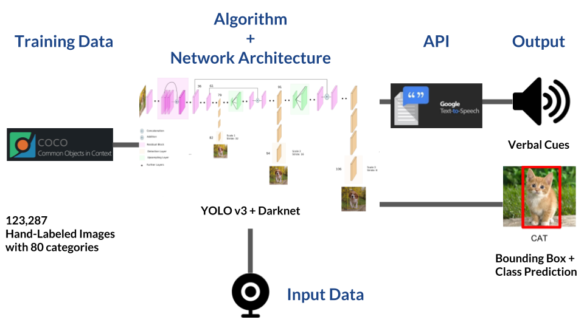

# Mobility aid for visually impaired persons

<br>
<br>

This project involves developing a mobility aid for visually impaired individuals. Using a real-time camera system, the aid provides instant audio feedback to users as they navigate outdoor environments. The system interprets visual data to identify obstacles and hazards, offering timely audio guidance. This innovation aims to enhance the independence and confidence of visually impaired individuals during outdoor activities.

<br>

## A very high-level overview

<br>

<p align="center">
 
</p> 

<br>

1. **Training Data**: The model undergoes training using the [Common Objects In Context](https://cocodataset.org/#explore) (COCO) dataset. Feel free to check out the labeled images at the provided link; it's quite fascinating.

2. **Model**: In this context, the model employed is the You Only Look Once (YOLO) algorithm, which operates within a modified and intricate Convolutional Neural Network architecture known as Darknet. Specifically, we utilize an improved and intricate version of the YOLO v3 model. The setup of Darknet from our configurations in the yolov3.cfg file is facilitated using the cv2 package in Python. As others have already trained COCO on YOLO v3, we opt for a pre-trained model, and we have acquired the corresponding weights stored in a file exceeding 200 MB.

3. **Input Data**: We will be using static images for now and feed them to this trained model. While in real implementation, our system will take images from camera as regular stream.

4. **Output**: We will be getting voice feedbacks in the form e.g. “bottom left cat” — meaning a cat was detected on the bottom-left of my camera view using Google Text-to-Speech
API using gTTS package by giving text description of the object.

## Voice Feedback

We can use bx & by relative to W & H to determine the position of the objects detected and send it as a text string to gTTS.

### **Note**:
You need to download the [yolo pretrained weights](https://pjreddie.com/media/files/yolov3.weights) and place it inside yolo folder to get started with the code.


# How to Run:
1. First run the requirements.txt file on terminal to isntall necessary packages using command:
```
pip install -r requirements.txt python 
```

2. Run the script.py from terminal using command: 
```
python script.py -i images/0.jpg -y yolo
```
## Installation Instructions

Before running the script, make sure to follow these installation steps:

### Step 1: Clone the Repository

Clone the project repository from [https://github.com/usama0005/Adv_RoboticsAI_2023_Proj.git](https://github.com/usama0005/Adv_RoboticsAI_2023_Proj.git):

```bash
git clone https://github.com/usama0005/Adv_RoboticsAI_2023_Proj.git
```

Navigate to the project directory:

```bash
cd Adv_RoboticsAI_2023_Proj
```

### Step 2: Download YOLO Pretrained Weights

Download the YOLO pretrained weights and place the file inside the 'yolo' folder: Adv_RoboticsAI_2023_Proj/yolo/yolov3.weights. You can obtain the weights file from [YOLO website]([https://yolov3.weights](https://pjreddie.com/media/files/yolov3.weights).

### Step 3: Set Up Virtual Environment (Optional but Recommended)

While not mandatory, it is recommended to use a virtual environment to isolate dependencies for this project. Create a virtual environment using the following commands:

```bash
python -m venv venv
```

Activate the virtual environment:

- On Windows:
  ```bash
  .\venv\Scripts\activate
  ```
- On macOS/Linux:
  ```bash
  source venv/bin/activate
  ```

### Step 4: Install Dependencies

Run the following command to install the required packages from the 'requirements.txt' file:

```bash
pip install -r requirements.txt
```

### Step 5: Run the Script

Now, you can run the script using the following command:

```bash
python script.py -i images/bottom.jpg -y yolo
```

Replace 'images/bottom.jpg' with the path to the image you want to analyze.

The script will process the image using the YOLO v3 model, and you should hear voice feedback describing the detected objects.

**Note**: Ensure you have Python installed on your system before proceeding with these steps.
